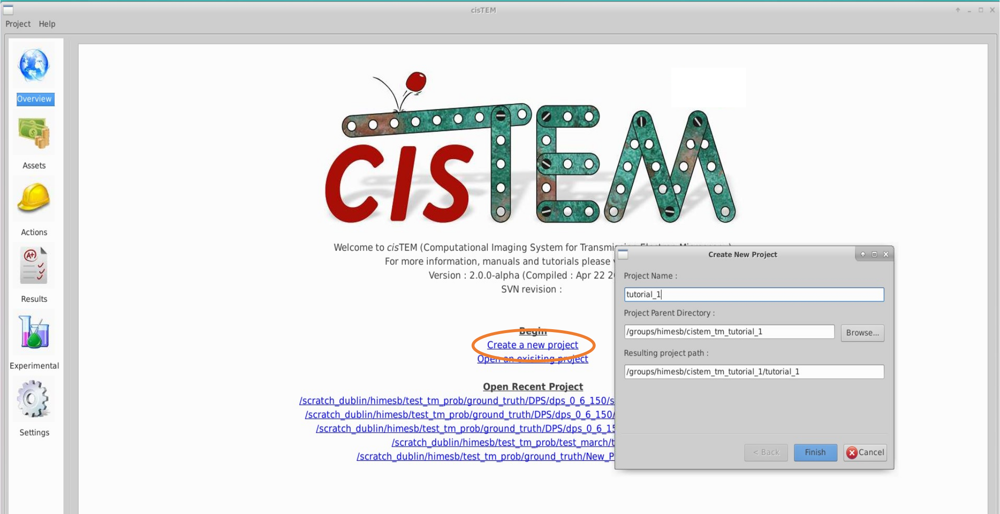
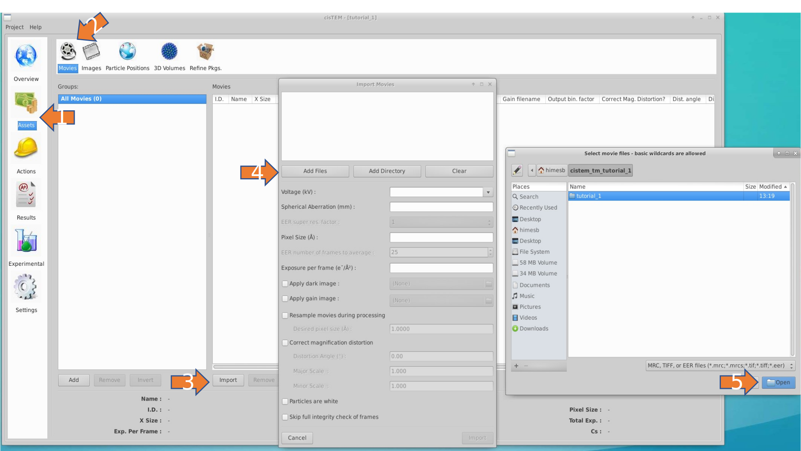
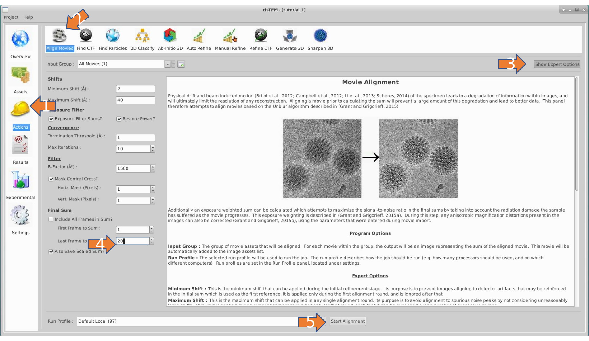
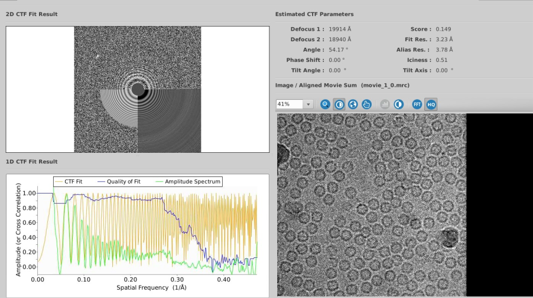

# <span style="color: #0048d8">***Tutorials***</span>

Template matching intro TODO:

## 1 - TM in the *cis*TEM GUI

### Project Setup

#### Download the EM data

We first need to obtain the data for the tutorial. If you have gone through the *cis*TEM single particle tutorial, then you already have it on hand. If not, we will be processing a single movie from that data set, which may be obtained from the CLI:

```bash
mkdir ${HOME}/cistem_tm_tutorial_1 ${HOME}/cistem_tm_tutorial_1/movies
cd ${HOME}/cistem_tm_tutorial_1/movies
wget -m ftp://ftp.ebi.ac.uk/empiar/world_availability/10146/data/May08_03.05.02.bin.mrc

# The full file structure is also created, so to save us some clicking, we link to the downloaded movie. Note, this is not necessary.
ln -s ftp.ebi.ac.uk/empiar/world_availability/10146/data/May08_03.05.02.bin.mrc  movie.mrc
```
#### Download the PDB model

Because these movies are binned, they are not particularly well compressed, so while you wait for your download to finish, we'll also grab the [PDB for horse spleen apoferritin](https://www.rcsb.org/structure/2w0o) that we'll use to generate our template. 

```{note}
You'll need to download the PDB format. Support for PDBx/mmCIF is brewing, but not yet available.
```

### Pre-process the data

#### create project

* open *cis*TEM 
* create a new project in the cistem_tm_tutorial_1 folder



#### import movie asset

Different types of data in *cis*TEM are referred to as assets. Import your movie assest, with data parameters:

* Voltage: 300
* Spherical Aberration: 0.001
* Pixel Size: 1.5
* Exposure Per Frame: 2.0



#### align your movie
% TODO: fix math text 
```{tip}
We tend to see the best detection with a total exposure between 30-50 e/A^2. When aligning your movies, you may select a range of frames to average together, we we choose 20 frames, corresponding to 40 e/A^2.
```


#### measure your ctf

You can use the default settings for this step. Your results should be similar to below:



### Generate your template

Instructions for this step can be found in [simulation tutorial 2.](calc_3d_scattering)

### Import your template

% TODO:
### Setup run profile
% TODO:
### Search
% TODO:
### Analyze results
% TODO:


