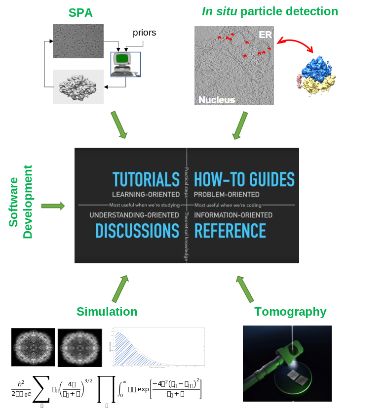

Welcome to your source for info about cisTEM
============================

*cis*TEM (computational imaging system for Transmission Electron Microscopy) _n_ - 

*cis*TEM is user-friendly software to process cryo-EM images of macromolecular complexes and obtain high-resolution 3D reconstructions from them. It was originally developed by Tim Grant, Alexis Rohou and Nikolaus Grigorieff and comprises a number of tools to process image data including movies, micrographs and stacks of single-particle images, implementing a complete “pipeline” of processing steps to obtain high-resolution single-particle reconstructions. cisTEM is distributed under the Janelia Research Campus Software License and can be downloaded [here](https://cistem.org/software).

### Beyond a single pipeline

The main objective of this documention is to enable you to use and/or contribute to the image processing library underlying *cis*TEM. 

 [^ref]

[^ref]: The documentation layout pic is a screen grab from [this talk](https://www.youtube.com/watch?v=t4vKPhjcMZg) by Daniele Procida.
