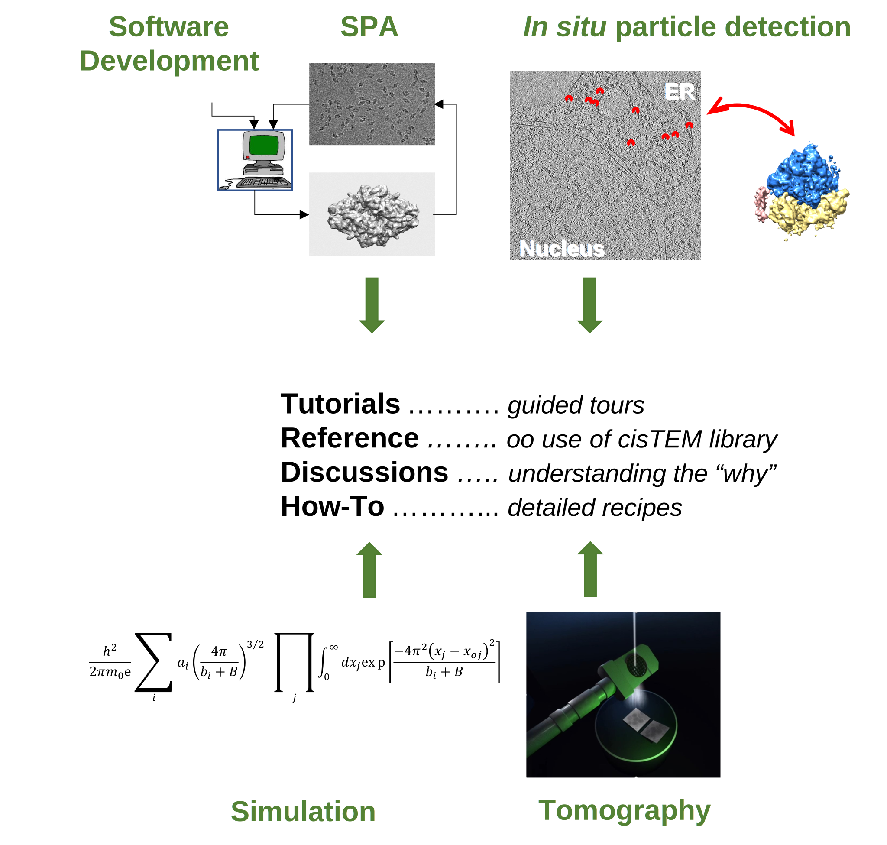

# Welcome to your source for info about *cis*TEM

*cis*TEM (computational imaging system for Transmission Electron Microscopy) _n_ - 


*cis*TEM is user-friendly software to process cryo-EM images of macromolecular complexes and obtain high-resolution 3D reconstructions from them. It was originally developed by Tim Grant, Alexis Rohou and Nikolaus Grigorieff and comprises a number of tools to process image data including movies, micrographs and stacks of single-particle images, implementing a complete “pipeline” of processing steps to obtain high-resolution single-particle reconstructions. cisTEM is distributed under the Janelia Research Campus Software License and can be downloaded [here](https://cistem.org/software).

## Request new documentation or report bugs

```{margin} ***Formatting TIP***
Use the **write** and **preview** tabs to see how the markdown you are editing in your github issue will look after submitting.
```
If you do not find the info you need, please request it via [How Do I ... request](https://github.com/bHimes/cisTEM_docs/issues/new?assignees=&labels=documentation&template=how-do-i-do----.md&title=)

If you find a bug, like a broken link, please report it [using this form](https://github.com/bHimes/cisTEM_docs/issues/new?assignees=&labels=bug&template=bug_report.md&title=)


## Beyond a single pipeline

The main objective of this documention is to enable you to use and/or contribute to the image processing library underlying *cis*TEM. 


 

